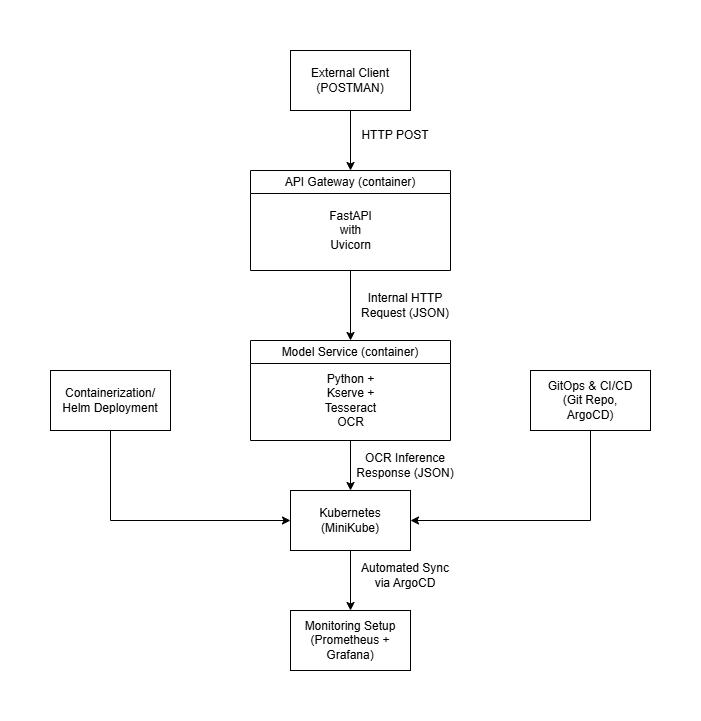

# OCR Inference System - DevOps Deployment

## Architecture Diagram


## Project Overview

This project is a containerized OCR (Optical Character Recognition) inference system consisting of two microservices:

- **FastAPI Gateway**: Accepts image uploads via HTTP, encodes them in base64, and proxies the request.
- **KServe Model Service**: Runs a Tesseract OCR model and handles inference.

The services are deployed on a Minikube Kubernetes cluster with GitOps using ArgoCD. Metrics are collected via Prometheus and visualized in Grafana.

---

## 1. Local Setup and Testing

```bash
# Install dependencies
sudo apt install python3.11 python3.11-venv
curl -sSL https://install.python-poetry.org | python3.11 -

# Setup virtual environment
poetry install

# Test locally using Postman
sh commands.sh
```
Use Postman:
- Method: POST
- URL: http://localhost:8001/gateway/ocr
- Body: form-data with key image_file (type: File)

## 2. Containerization
Dockerfiles are provided in docker/model/Dockerfile and docker/gateway/Dockerfile.

### Build & Push
```bash
chmod +x build_images.sh
./build_images.sh

# Push
docker login
docker push yaishriaz/ocr-model-service:latest
docker push yaishriaz/ocr-api-gateway:latest
```

### Strategy Summary
- Base image: python:3.11-slim (small, secure)
- Poetry used for dependency management
- Layer caching enabled for faster rebuilds
- Metrics exposed via prometheus_fastapi_instrumentator

## 3. Infrastructure Setup
```bash
cd infra
./setup.sh
```
Installs:
ArgoCD (argocd namespace)
Prometheus & Grafana (monitoring namespace)

## 4. Kubernetes Deployment
Helm chart located in `ocr-services/`.
```bash
helm package ./ocr-services
helm upgrade ocr-services ./ocr-services-0.1.0.tgz
```
Includes:
- Deployments
- Services (NodePort)
- Prometheus annotations
- Image pull from Docker Hub

## 5. GitOps with ArgoCD
```bash
kubectl apply -f argo/argo-application.yaml -n argocd
```
Manages deployments of both microservices from GitHub source.

## 6. Monitoring with Prometheus & Grafana

### Prometheus Annotations
Added in `deployment-gateway.yaml`:
```yaml
metadata:
  annotations:
    prometheus.io/scrape: "true"
    prometheus.io/port: "8001"
    prometheus.io/path: "/metrics"
```

### Grafana Dashboard Metrics
- Inference Count: `sum(rate(request_predict_seconds_count[1m]))`
- Latency Histogram: `histogram_quantile(0.95, sum(rate(request_predict_seconds_bucket[5m])) by (le))`
- Error Rate: `sum(rate(request_errors_total[1m]))`
- CPU Usage: `rate(container_cpu_usage_seconds_total[1m])`
